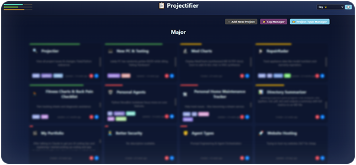
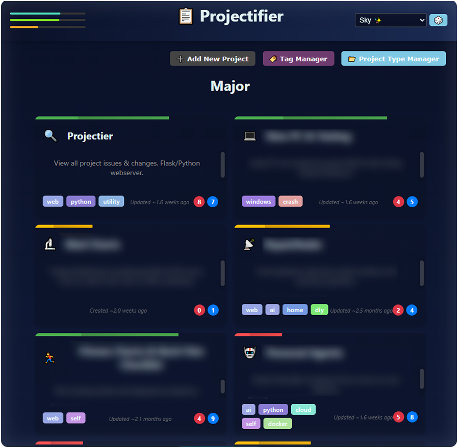
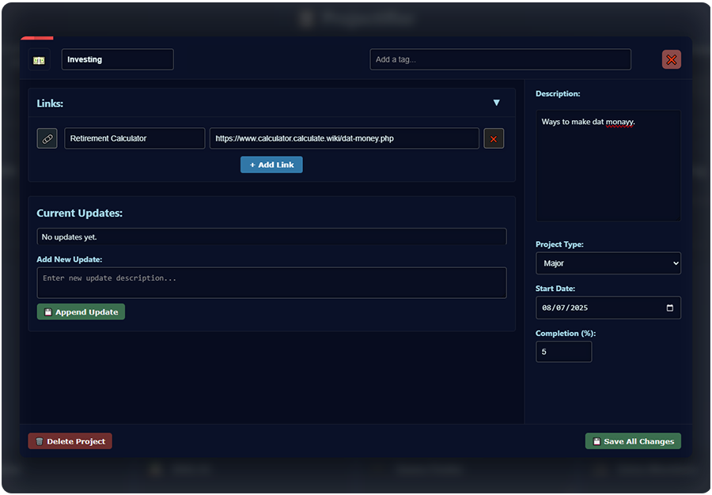
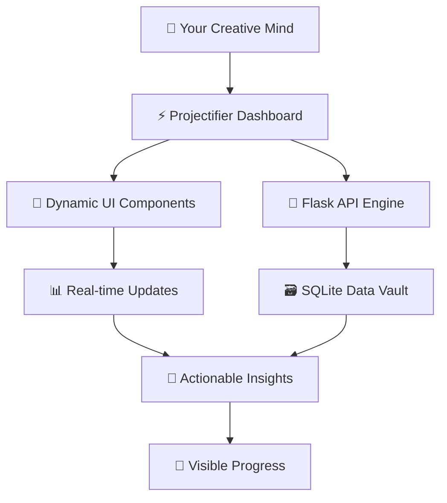

<div align="center">

# 🚀 **Projectifier**  
### ✨ Your Dynamic Command Center for Personal Projects ✨

<p align="center">
  
  
  
  
  
</p>

**Transform scattered notes and brilliant ideas into a centralized, visually stunning dashboard.**  
Projectifier brings clarity, focus, and momentum to your creative and technical work.



</div>

---

## 🎯 The Problem → The Solution

<table>
<tr>
<td width="50%">

### 😫 Before Projectifier
- Notes scattered across multiple apps
- Mental energy wasted tracking locations
- Brilliant ideas buried and forgotten
- Projects stalling before completion

</td>
<td width="50%">

### 🚀 After Projectifier
- **One** gorgeous dashboard for everything
- Crystal-clear priorities at a glance
- Addictive progress tracking
- Ideas that become shipped projects

</td>
</tr>
</table>

---

## 🌟 What Projectifier Does

**A lightweight project hub for people with too many ideas and not enough visibility.**

From a single browser window:

* **📂 Unified Project View** — See all projects with key details (title, status, tags, dates) without clicking through multiple tools
* **✅ Rich Project Modals** — Manage subtasks, tags, metadata, and notes in dedicated overlays
* **🔄 Real-time Updates** — Change statuses, edit text, and manage tasks without page reloads
* **🧠 Mental Freedom** — Focus on *what* to work on, not *where* to find it

<div align="center">





</div>

---

## ⚙️ Technical Stack

**Lightweight, monolithic Flask application designed for local-first use and easy extension.**

### 🧩 Architecture

* **Backend:** Python 3.9+, Flask 2.x with Blueprint architecture
* **Database:** SQLite + SQLAlchemy ORM for serverless persistence
* **Frontend:** Jinja2 templates, Vanilla JavaScript (ES6), CSS3 Grid/Flexbox

### 🔑 Key Features

* **Modular Blueprints** — Clean separation of concerns with `/blueprints/projects.py`
* **Data Integrity** — Error-aware commit patterns in centralized `database.py`
* **Dynamic UI** — Modal-driven interfaces (`modal.js`, `modalSubtasks.js`, `modalTags.js`)
* **State Management** — Client-side state with `appState.js` and instant visual feedback
* **Themable Design** — Swappable themes via `_dark.css` / `_light.css` + centralized variables



---

## ⚡ Getting Started

### Quick Start

```bash
git clone https://github.com/zfyant/projectifier
cd projectifier
pip install -r requirements.txt
python app.py
```

**🎉 Your dashboard is live at `http://localhost:5000`**

### Recommended Setup (with virtual environment)

```bash
# Create and activate virtual environment
python -m venv venv

# Windows:
venv\Scripts\activate

# macOS/Linux:
source venv/bin/activate

# Install dependencies and run
pip install -r requirements.txt
flask run --debug
```

---

## 🛠️ Perfect For

* **🏗️ Hobbyists & Makers** — Track woodworking, 3D printing, crafts, and content pipelines
* **🎓 Students & Researchers** — Manage papers, experiments, deadlines, and study sprints
* **👨‍💻 Indie Developers** — Organize feature ideas, prototypes, and product roadmaps

---

## 🧬 Extensibility

Built for customization:

* **➕ Custom Fields** — Add columns to `projects.db` and wire into templates
* **🌐 API Integrations** — Create new routes in `/blueprints` for GitHub, Trello, etc.
* **🎨 Custom Themes** — Modify `_variables.css` for instant global styling changes

---

## 🌈 Roadmap

```text
✅ PHASE 1: FOUNDATION
   └── Intuitive core features and lightning-fast UI

🔄 PHASE 2: INTELLIGENCE
   └── Analytics, insights, and export capabilities

📋 PHASE 3: ECOSYSTEM
   └── Plugin architecture and third-party integrations
```

---

<div align="center">

### 🚀 Ready to Launch?

<a href="https://github.com/Zfyant/Projectifier">

</a>

**Built with obsessive attention to detail, for people who ship.**

</div>
