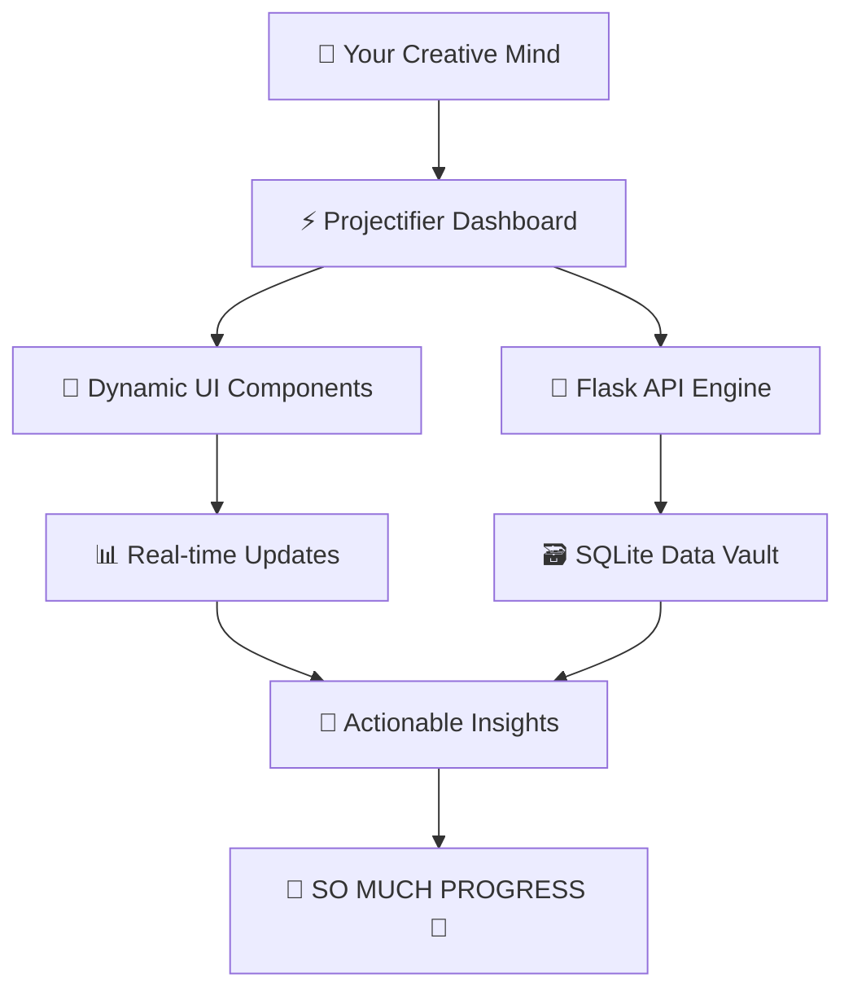

<div style="text-align: center;">

# 🚀 **Projectifier** 🚀

### ✨ **Your Dynamic Command Center for Personal Projects** ✨


<p align="center">
  
  
  
  
  
  
</p>

**Transform your scattered notes and brilliant ideas into a centralized, visually stunning dashboard. Projectifier is engineered to bring clarity, focus, and momentum to your creative endeavors.**

---


## 💫 **STOP DROWNING IN YOUR OWN IDEAS** 💫 

</div>

### The Problem That Haunts Every Creative Mind
```
📝 Notes scattered across 12 different apps and 31 different tabs between two panes
🧠 Mental energy gets wasted remembering what's where  
⏰ Brilliant ideas are forgotten into digital graveyards
🎯 Projects that never see the finish line
```

### The Projectifier Solution: **INSTANT CLARITY**
```
🚀 ONE dashboard that rules them all
⚡ Lightning-fast project switching
🎨 Visual organization that actually makes sense
🏆 The dopamine hit of watching you make progress happen
⭐ Stunning visuals
```

---

<div style="text-align: center;">

## 🔥 **EXPERIENCE THE DIFFERENCE**

</div>

<table>
<tr>
<td width="50%">

### 😫 **BEFORE PROJECTIFIER**
- Switching between 5+ apps to check project status
- Forgetting which project needs attention
- Losing momentum from decision fatigue
- Ideas dying in digital graveyards

</td>
<td width="50%">

### 🚀 **AFTER PROJECTIFIER**
- **ONE** gorgeous dashboard for everything
- Crystal-clear project priorities at a glance
- Addictive progress tracking that builds momentum
- Ideas that actually become reality

</td>
</tr>
</table>

---
<div style="text-align: center;">


</div>

---

<div style="page-break-after: always;"></div>

<div style="text-align: center;">


## 💎 **THE ARCHITECTURE OF AMBITION**

</div> 



Projectifier is the perfect command center for:

  - 🛠️ **Hobbyists & Makers**: Organize your creative genius, from woodworking plans to 3D printing queues.
  - 🎓 **Students & Researchers**: Manage academic papers, complex experiments, and critical deadlines in one structured place.
  - 👨‍💻 **Indie Developers**: Track every software project, from that first spark of an idea to a full-scale launch.

---

<div style="text-align: center;">

## 🚀 **READY FOR LIFTOFF?**

</div>

### ⚡ **INSTANT GRATIFICATION SETUP**

```bash
# Three commands to transform your productivity:
git clone https://github.com/zfyant/projectifier
pip install -r requirements.txt
python app.py

# 🎉 BOOM! Your command center is live!
```

### 📊 **THE NUMBERS DON'T LIE**

<div style="text-align: center;">

| 🎯 **METRIC** | 📈 **IMPACT** | 🔥 **REALITY CHECK** |
|---------------|---------------|----------------------|
| **Setup Time** | `< 60 seconds` | Faster than making coffee |
| **Learning Curve** | `Intuitive` | Your grandmother could use it |
| **Performance** | `Lightning⚡` | Faster than your thoughts |
| **Reliability** | `Bulletproof🛡️` | Like a Swiss watch, but cooler |

</div>

---

<div style="text-align: center;">

## 🌈 **ROADMAP TO GREATNESS**

</div> 

### 🎯 **PHASE DOMINATION**

```
🏁 PHASE 1: FOUNDATION MASTERY ✅
   └── Core features that actually matter
   └── UI so smooth it should be illegal
   └── Performance that breaks expectations

🚀 PHASE 2: INTELLIGENCE INJECTION 🔄
   └── Smart analytics that predict your needs
   └── AI-powered project insights
   └── Export options for every workflow

🌟 PHASE 3: ECOSYSTEM EXPANSION 📋
   └── Plugin architecture for infinite customization
   └── Third-party integrations that just work
   └── Community-driven feature evolution
```

---

<div style="text-align: center;">

## 🎭 **THE BRUTAL TRUTH**

</div>

### ❌ **THIS ISN'T FOR EVERYONE**

**Don't use Projectifier if you:**
- Love the chaos of scattered notes
- Enjoy the thrill of forgotten deadlines  
- Think productivity tools are "too complicated"
- Prefer making excuses over making progress

### ✅ **THIS IS YOUR WEAPON IF YOU:**
- Have more ideas than time
- Want to see your projects actually finish
- Believe in the power of good organization
- Are ready to level up your creative output

---

<div style="text-align: center;">

### 🚀 **READY TO TRANSFORM YOUR PRODUCTIVITY?**

<a href="https://github.com/Zfyant/Projectifier">

</a>

**Your future organized self is waiting.**

---

*Built with obsessive attention to detail. - Designed for people who demand excellence.*

</div>


